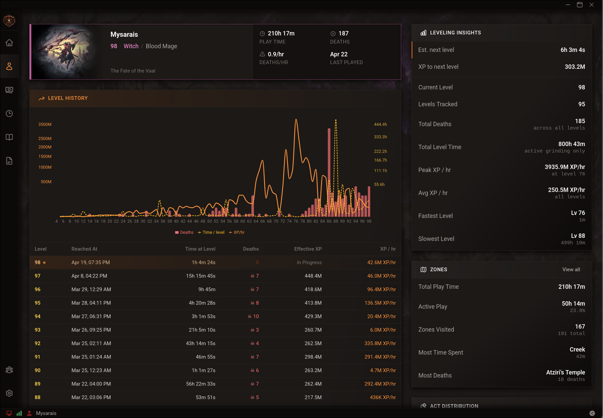

# POE2 Overlord

A companion app for Path of Exile 2. Tracks your characters, zones, economy, and campaign progress in a lightweight desktop overlay built with Tauri and React.



---

## Features

- **Dashboard** — At-a-glance view of your active character, current zone, walkthrough progress, exchange rates, and pinned notes
- **Character Tracking** — Manage multiple characters; tracks class, level, and playtime per character
- **Zone Tracking** — Reads the game log in real time to detect your current zone and record per-zone statistics
- **Economy** — Live currency exchange rates with search, sorting, and starred/favourited currencies
- **Campaign Walkthrough** — Step-by-step act guide with your current position tracked automatically
- **Notes** — Rich-text notes tied to your session; pin notes to the dashboard
- **Playtime** — Detailed playtime breakdown by act and session
- **Server Status** — Monitors POE2 server health so you know when it's the game, not you
- **Item Data** — Searchable item database bundled with the app and updated per patch

---

## Installation

Download the latest release for your platform from the [Releases](https://github.com/dmeents/poe2-overlord/releases) page.

| Platform | Installer |
|----------|-----------|
| Windows  | `.msi` or `.exe` |
| macOS    | `.dmg` |
| Linux    | `.AppImage` or `.deb` |

Run the installer and launch **POE2 Overlord**. No configuration required — the app detects your game log automatically.

---

## Development

### Prerequisites

- [Rust](https://rustup.rs/) (stable, 1.89+)
- [Node.js](https://nodejs.org/) (20+)
- [pnpm](https://pnpm.io/) (10+)
- Tauri system dependencies — see the [Tauri prerequisites guide](https://tauri.app/start/prerequisites/) for your OS

### Getting Started

```bash
# Clone the repo
git clone https://github.com/dmeents/poe2-overlord.git
cd poe2-overlord

# Install dependencies
pnpm install

# Start the app in dev mode (frontend + backend)
pnpm dev
```

### Useful Commands

```bash
pnpm dev              # Desktop app (Tauri + React hot-reload)
pnpm build            # Production build

pnpm dev:website      # Marketing website (Next.js)

pnpm lint             # Lint all packages
pnpm format           # Format all code
pnpm typecheck        # Type-check all packages
pnpm test             # Run all tests
pnpm test:backend     # Rust tests only
```

### Project Structure

```
packages/
  backend/     Rust + Tauri 2 (IPC commands, domains, SQLite)
  frontend/    React 19 + TypeScript + Vite (desktop UI)
  theme/       Shared Tailwind v4 design tokens
  website/     Next.js 15 marketing site
```

Each backend domain follows the pattern: `models.rs` → `traits.rs` → `service.rs` → `repository.rs` → `commands.rs`.

---

## License

[PolyForm Shield 1.0.0](https://polyformproject.org/licenses/shield/1.0.0/) — free for personal use; contact the author for commercial licensing.

Path of Exile 2 is a trademark of Grinding Gear Games. This project is not affiliated with or endorsed by Grinding Gear Games.
